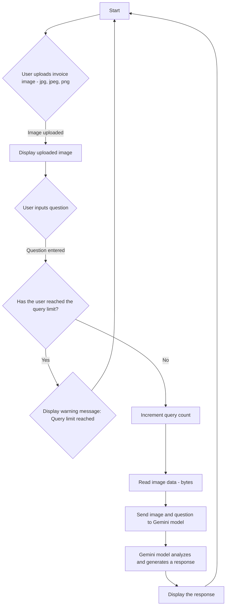

# invoice-extractor-app
Uses Gemini AI to extract context from invoice image

```mermaid
flowchart TD
    A[Start] --> B{User uploads invoice image - jpg, jpeg, png};
    B -- Image uploaded --> C[Display uploaded image];
    C --> D{User inputs question};
    D -- Question entered --> E{Has the user reached the query limit?};
    E -- Yes --> J{Display warning message: Query limit reached};
    E -- No --> F[Increment query count];
    F --> G[Read image data - bytes];
    G --> H[Send image and question to Gemini model];
    H --> I[Gemini model analyzes and generates a response];
    I --> K[Display the response];
    K --> A;
    J --> A;
```
